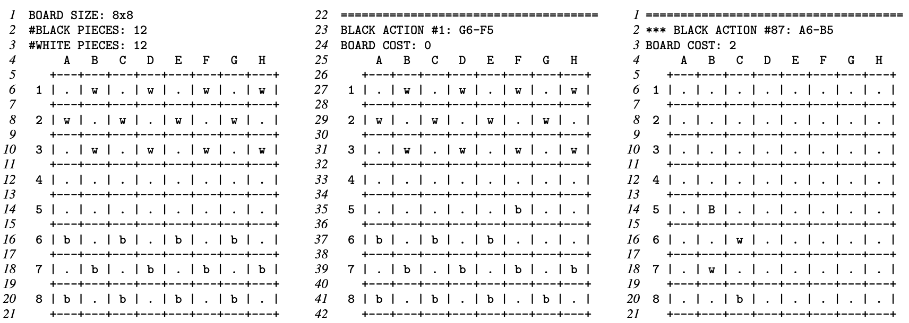

# Checker-Bot
Implementation of minimax algorithm for playing a variant of checkers.
Project based on COMP10002 2021 Semester 2 Assignment 2 

## Rules
**Setup.** An 8x8 chessboard with 12 black and 12 white pieces initially positioned as shown in Figure 1a.

**Gameplay.** Each player plays all pieces of the same color. Black open the game by making a move, then white make a move, and then players alternate their turns. In a single turn, the player either makes a move or capture. For example, the arrow in Figure 1a denotes an opening move of the black piece from cell G6 to cell F5.

**Moves.** A piece may move to an empty cell diagonally forward (toward the opponent; north for black and south for white) one square. The arrows in Figure 1b show all the legal moves of black and white pieces.

**Towers.** When a piece reaches the furthest row (the top row for black and the bottom row for white), it becomes a tower (a pile of pieces). The only move of the white piece at cell D7 in Figure 1b promotes it to the tower. A tower may move to an empty cell diagonally, both forward and backward, one square. The arrows in Figure 1c show all the legal moves of black and white towers.

**Captures.** To capture a piece or a tower of the opponent, a piece or a tower of the player jumps over it and lands in a straight diagonal line on the other side. This landing cell must be empty. When a piece or tower is captured, it is removed from the board. Only one piece or tower may be captured in a single jump, and, in our variant of the game, only one jump is allowed in a single turn. Hence, if another capture is available after the first jump, it cannot be taken in this turn. Also, in our variant of the game, if a player can make a move or a capture, they may decide which of the two to complete. A piece always jumps forward (toward the opponent), while a tower can jump forward and backward. The arrows in Figure 1d show all the legal captures for both players.

**Game end.** A player wins the game if it is the opponent’s turn and they cannot take action, move or capture, either because no their pieces and towers are left on the board or because no legal move or capture is possible.

## Input
### Input File Format
The input should list actions, one per line, starting from the initial setup and a black move. The input of moves and captures can be followed by a single command character, either ‘A’ or ‘P’. Action should be specified as a pair of the source cell and the target cell, separated by the minus character ‘-’.

See *tests* for examples.

### Commands in Input File
- If the 'A' command follows the input actions, the program computes and prints the information about the next action of the player with the turn according to the minimax decision rule for the tree depth of three. 
- If the 'P' command follows the input actions, the program plays the ten next actions or all actions until the end of the game, whatever comes first. 

## Output

Lines 1–21 report the board configuration and specify the initial setup. We use ‘*b*’ and ‘*w*’ characters to denote black and white pieces, respectively. Then, lines 22–42 print the first move specified in the first line of the input. The output of each action starts with the delimiter line of 37 ‘=’ characters; see line 22. The next two lines print information about the action taken and the cost of the board; see lines 23 and 24. The cost of a board is computed as *b + 3B − w − 3W*, where *b*, *w*, *B*, and *W* are, respectively, the number of black pieces, white pieces, black towers, and white towers on the board; that is, a tower costs three pieces. Then, the program prints the board configuration that results from the action.

If an illegal action is encountered in the input, the program selects and prints one of the following six error messages. The program terminate immediately after printing the error message.

- ERROR: Source cell is outside of the board. 
- ERROR: Target cell is outside of the board. 
- ERROR: Source cell is empty.
- ERROR: Target cell is not empty.
- ERROR: Source cell holds opponent’s piece/tower. 
- ERROR: Illegal action.


See *output* for example.

## Execution
```
gcc -Wall -o checker_bot checker_bot.c
```
```
./checker_bot < tests/test1.txt
```